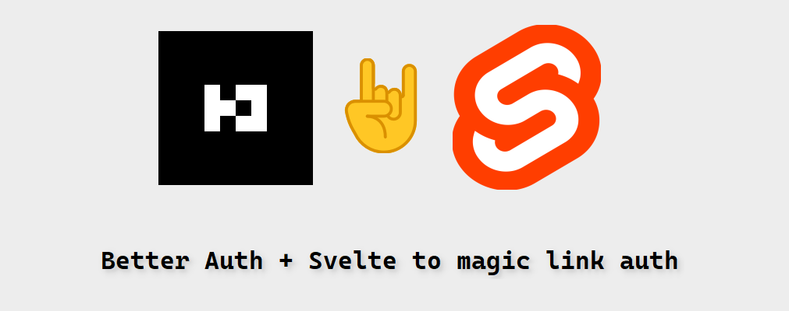

# Svelte Magic Link Auth

This is a SvelteKit project that uses Magic Links for authentication.

## 👁 Features

- Use Magic Links for authentication
- Use SQLite as the database
- Use Drizzle for database operations
- Use Better Auth for authentication and authorization
- Use SvelteKit for the frontend framework

## 💻 Installation

1. Clone the repository
2. Install the dependencies with `npm install`
3. Create a `.env` file with the following variables:
   - `DATABASE_URL`: the URL of your SQLite database
4. Run `npm run dev` to start the development server
5. Open your web browser and navigate to `http://localhost:5173`

> > [!TIP]
> > I am using mail server localhost:1025 with SMTP.
> > software: [Mailpit](https://github.com/axllent/mailpit)

## 🔑 Usage

1. Go to /auth and click on the "Sign In" button
2. Enter your email address and click on the "Send Magic Link" button
3. Check your email for a link to sign in
4. Click on the link to sign in

## 📝 License

This project is licensed under the MIT License. See the [LICENSE](LICENSE) file for details.
